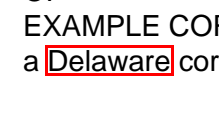

# core


<!-- WARNING: THIS FILE WAS AUTOGENERATED! DO NOT EDIT! -->

fastpdfium is a small ergonomic layer over
[pypdfium2](https://pypdfium2.readthedocs.io/) for working with PDFs
interactively – in Jupyter, solveit, or an AI-driven kernel. The design
rule: reach for *text* first (cheap, precise), and for *pixels* when
layout matters. Search is content-based: a hit knows its matched text
and surroundings, and can show itself highlighted on the rendered page.

pypdfium2 wraps PDFium, the permissively-licensed PDF engine from
Chrome, so fastpdfium is plain Apache-2.0.

``` python
from fastcore.test import *
```

## Pages know their number

pypdfium2 pages don’t record their index, but page-tagged text and
search results need it. We wrap the two ways a page is loaded so every
page carries a `number` (and `new_page` gains an A4 default while we’re
at it).

------------------------------------------------------------------------

### PdfDocument.new_page

``` python
def new_page(
    width:int=595, height:int=842, index:NoneType=None
):
```

*Append (or insert at `index`) a blank `width`x`height` point page,
numbered like `get_page`*

------------------------------------------------------------------------

### PdfDocument.get_page

``` python
def get_page(
    index
):
```

*Load page `index`, remembering it as `page.number`*

``` python
d = pdfium.PdfDocument.new()
pg = d.new_page()
test_eq(pg.number, 0)
test_eq(pg.get_size(), (595, 842))
test_eq(d[0].number, 0)
```

## Creating PDFs

pypdfium2’s helpers stop at page shuffling, but PDFium’s raw API can
author content. These helpers cover the common needs: text, boxes, and
images. Positions are in points from the *top-left* of the page,
matching how you look at a rendered preview; the y-flip to PDF’s
bottom-left convention happens inside.

------------------------------------------------------------------------

### PdfPage.insert_text

``` python
def insert_text(
    text, # Text to insert; newlines start new lines
    x:int=72, # Baseline start x, in points from the left
    y:int=72, # Baseline start y, in points from the top
    size:int=12, # Font size in points
    font:str='Helvetica', # Standard PDF font name
):
```

*Insert `text` on the page at `x`,`y`*

``` python
pg.insert_text('Hello\nPDF world', 72, 100, size=14)
test_eq(pg.get_textpage().get_text_range(), 'Hello\r\nPDF world')
```

------------------------------------------------------------------------

### PdfPage.draw_rect

``` python
def draw_rect(
    x0, y0, x1, y1, # Corners, in points from the top-left
    stroke:tuple=(255, 0, 0, 255), # Stroke RGBA, 0-255 each (None for none)
    fill:NoneType=None, # Fill RGBA (None for none)
    width:int=1, # Stroke width in points
):
```

*Draw a rectangle from `x0`,`y0` to `x1`,`y1`*

``` python
p2 = d.new_page(100, 100)
p2.draw_rect(10, 10, 90, 90, width=4)
test_eq(p2.render(scale=1).to_pil().getpixel((50, 10))[:3], (255, 0, 0))
p2.render(scale=2).to_pil()
```


------------------------------------------------------------------------

### PdfPage.insert_image

``` python
def insert_image(
    img, # PIL image, or a path PIL can open
    x:int=72, # Left edge of the placed image, in points
    y:int=72, # Top edge of the placed image, in points
    w:NoneType=None, # Width in points (default: pixel size; aspect kept if only one given)
    h:NoneType=None, # Height in points
):
```

*Place `img` at `x`,`y` (stored as JPEG)*

``` python
p3 = d.new_page(100, 100)
p3.insert_image(Image.new('RGB', (40, 30), 'orange'), 30, 40)
test_close(p3.render(scale=1).to_pil().getpixel((50, 55))[:3], (255, 165, 0), eps=20)
```

Serializing to bytes rounds out authoring: build a document in memory
and hand it anywhere that expects PDF data.

------------------------------------------------------------------------

### PdfDocument.tobytes

``` python
def tobytes()->bytes:
```

*The document serialized as PDF bytes*

``` python
b = d.tobytes()
test_eq(b[:5], b'%PDF-')
test_eq(len(pdfium.PdfDocument(b)), 3)
```

## A sample document

With authoring in hand, the rest of the notebook reads a small two-page
PDF built right here, so the demos are deterministic and self-contained.

``` python
smpl = pdfium.PdfDocument.new()
for lines in (['CERTIFICATE OF INCORPORATION','OF','EXAMPLE CORP','a Delaware corporation'],
              ['ARTICLE ONE','The name of the corporation is','Example Corp']):
    smpl.new_page().insert_text('\n'.join(lines), 72, 92, size=14)
pg0 = smpl[0]
```

## Text

Most questions about a PDF are answered by its text. `Page.text`
normalizes PDFium’s CRLF line breaks; `Document.text` gives the whole
document (or chosen pages) in one string, with page markers so line
references stay grounded.

------------------------------------------------------------------------

### PdfPage.text

``` python
def text()->str:
```

*Plain text of the page*

``` python
test_eq(pg0.text(), 'CERTIFICATE OF INCORPORATION\nOF\nEXAMPLE CORP\na Delaware corporation')
```

------------------------------------------------------------------------

### PdfDocument.text

``` python
def text(
    pages:NoneType=None
)->str:
```

*Plain text of `pages` (default: all), with `--- page N ---` separators*

``` python
t = smpl.text()
assert 'CERTIFICATE OF INCORPORATION' in t and '--- page 1 ---' in t
assert 'ARTICLE ONE' not in smpl.text(pages=[0])
print(t)
```

    --- page 0 ---
    CERTIFICATE OF INCORPORATION
    OF
    EXAMPLE CORP
    a Delaware corporation
    --- page 1 ---
    ARTICLE ONE
    The name of the corporation is
    Example Corp

## Search

Search is content-based, PDFium’s way: a
[`Match`](https://AnswerDotAI.github.io/fastpdfium/core.html#match) is a
range of characters on a page, so it knows its matched text and can show
the text around it – which is what an LLM (or a person) actually wants
from a search hit. Geometry stays internal, used only to draw
highlights.

------------------------------------------------------------------------

### PdfDocument.search

``` python
def search(
    q, # Text to search for
    match_case:bool=False, # Case-sensitive?
    match_whole_word:bool=False, # Whole words only?
    consecutive:bool=False, # Allow overlapping matches?
)->list:
```

*All
[`Match`](https://AnswerDotAI.github.io/fastpdfium/core.html#match)es
for `q` across the document*

------------------------------------------------------------------------

### PdfPage.search

``` python
def search(
    q, # Text to search for
    match_case:bool=False, # Case-sensitive?
    match_whole_word:bool=False, # Whole words only?
    consecutive:bool=False, # Allow overlapping matches?
)->list:
```

*All
[`Match`](https://AnswerDotAI.github.io/fastpdfium/core.html#match)es
for `q` on this page*

------------------------------------------------------------------------

<a
href="https://github.com/AnswerDotAI/fastpdfium/blob/main/fastpdfium/core.py#L124"
target="_blank" style="float:right; font-size:smaller">source</a>

### Match

``` python
def Match(
    page, i, n, tp:NoneType=None
):
```

*A search hit: chars `i` to `i+n` on `page`*

``` python
ms = smpl.search('corporation')
test_eq([m.page.number for m in ms], [0, 0, 1])
test_eq(ms[1].text, 'corporation')
test_eq(smpl.search('nonexistent'), [])
ms
```

    [page 0: CERTIFICATE OF IN**CORPORATION** OF EXAMPLE CORP a Delaware corporati,
     page 0: RPORATION OF EXAMPLE CORP a Delaware **corporation**,
     page 1: ARTICLE ONE The name of the **corporation** is Example Corp]

The match options come straight from PDFium, and `ctx` gives an
LLM-ready snippet: the hit marked inline, with its surroundings.

``` python
test_eq(len(smpl.search('CORPORATION', match_case=True)), 1)
assert '**corporation**' in ms[1].ctx()
ms[1].ctx(chars=12)
```

    ' a Delaware **corporation**'

## Preview

`Page.preview` renders to a PIL image at `dpi` (default 150: a page is
~1650px on the long edge, comfortably readable for vision models while
staying cheap). Pass a query `q` and the matches are outlined in red;
add `crop=True` to cut down to just the matched region plus a `margin`
of context. PDFium’s hit boxes hug the glyphs, so highlights get a
couple points of breathing room.

------------------------------------------------------------------------

### PdfPage.preview

``` python
def preview(
    q:NoneType=None, # Text whose matches to highlight
    dpi:int=150, # Render resolution
    crop:bool=False, # Crop to the matched region?
    margin:int=24, # Points of context around a crop
):
```

*Render to a PIL image, highlighting and optionally cropping to `q`’s
matches*

``` python
im = pg0.preview()
assert abs(im.width - 595*150/72) <= 1 and abs(im.height - 842*150/72) <= 1
test_fail(lambda: pg0.preview('missing text'), contains='not found')
pg0.preview('CERTIFICATE OF INCORPORATION')
```


`crop=True` renders just the neighborhood of the hits – the cheap way to
show a vision model exactly the region that matters:

``` python
pg0.preview('Delaware', crop=True)
```


### Pages display themselves

With a `_repr_png_`, a bare `Page` expression renders visually in any
rich frontend.

``` python
assert pg0._repr_png_()[:8] == b'\x89PNG\r\n\x1a\n'
pg0
```


The idioms compose: search the document, read a match in context, then
look at it on the page.

``` python
m = smpl.search('Delaware')[0]
m.page.preview('Delaware', crop=True)
```


